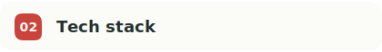
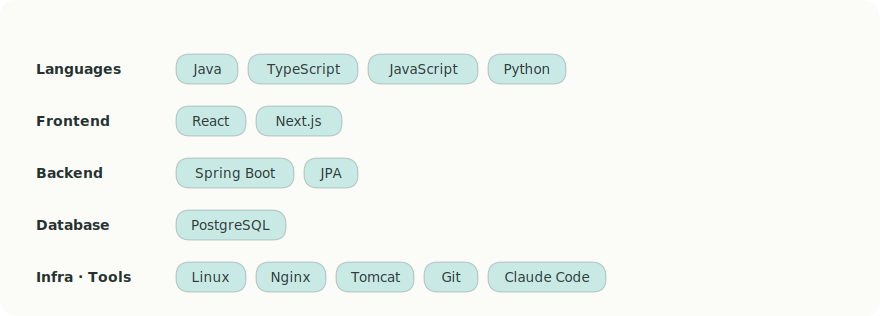

<div align="center">

<!-- 헤더 배너 (블로그 '승이의 개발 일기' 디자인) -->


<br /><br />

<!-- 타이핑 애니메이션 -->
<picture>
  <source media="(prefers-color-scheme: dark)" srcset="https://readme-typing-svg.demolab.com?font=Noto+Sans+KR&size=20&duration=3500&pause=800&color=C8E9E4&center=true&vCenter=true&width=600&lines=%EB%AC%B8%EC%A0%9C%EB%A5%BC+%ED%95%B4%EA%B2%B0%ED%95%98%EA%B3%A0+%EB%8D%94+%EB%82%98%EC%9D%80+%EC%BD%94%EB%93%9C%EB%A5%BC+%EA%B3%A0%EB%AF%BC%ED%95%98%EB%8A%94+%EA%B0%9C%EB%B0%9C%EC%9E%90;Web+Developer+%7C+Java+%C2%B7+Spring+%7C+React;%EB%8D%B0%EC%9D%B4%ED%84%B0+%EA%B5%AC%EC%A1%B0%EC%99%80+%EB%8F%84%EB%A9%94%EC%9D%B8+%EC%84%A4%EA%B3%84%EB%A5%BC+%EA%B3%A0%EB%AF%BC%ED%95%98%EB%8A%94+%EA%B0%9C%EB%B0%9C%EC%9E%90" />
  
</picture>

<br />

<!-- 방문자 카운터 + 팔로워 -->


</div>

<br />

<!-- 01 About me -->
<picture>
  <source media="(prefers-color-scheme: dark)" srcset="assets/section-about-dark.svg" />
  
</picture>

```typescript
const developer = {
  name: "정현승 (Hyeonseung Jeong)",
  role: "Web Developer",
  location: "Republic of Korea",
  email: "saver7942@gmail.com",
  motto: "RPG 캐릭터가 스킬을 얻으며 레벨을 올리듯, 기술 스택을 쌓는 것을 즐깁니다.",
  currentlyLearning: ["Spring Boot", "Python"],
};
```

<br />

<!-- 02 Tech stack -->
<picture>
  <source media="(prefers-color-scheme: dark)" srcset="assets/section-stack-dark.svg" />
  
</picture>

<picture>
  <source media="(prefers-color-scheme: dark)" srcset="assets/stack-dark.svg" />
  
</picture>

<br /><br />

<!-- 03 Career -->
<picture>
  <source media="(prefers-color-scheme: dark)" srcset="assets/section-career-dark.svg" />
  
</picture>

<table>
  <tr>
    <th width="200">Period</th>
    <th>Organization</th>
    <th>Role</th>
  </tr>
  <tr>
    <td align="center"><b>2022.03 – 2024.03</b></td>
    <td><b>제타럭스시스템</b> <sub>SI사업부 / 주임</sub><br /><sub>공공·지자체 발주 웹 프로젝트</sub></td>
    <td>
      공공·지자체 발주 웹 프로젝트 수행<br />
      <b>Front-End</b> · React 기반 UI/UX 및 화면 기능 구현<br />
      <b>Back-End</b> · API 및 DB 설계·쿼리, Linux 환경 WAS 배포 및 운영
    </td>
  </tr>
</table>

<br />

<!-- 04 Certifications -->
<picture>
  <source media="(prefers-color-scheme: dark)" srcset="assets/section-cert-dark.svg" />
  
</picture>

| Certification | Issued by |
| :--- | :--- |
| **정보처리기사** | 한국산업인력공단 |
| **삼성 소프트웨어 역량테스트 A 등급** | Samsung Electronics |

<br />

<!-- 05 GitHub stats -->
<picture>
  <source media="(prefers-color-scheme: dark)" srcset="assets/section-stats-dark.svg" />
  
</picture>

<div align="center">

<picture>
  <source media="(prefers-color-scheme: dark)" srcset="https://github-readme-streak-stats.herokuapp.com/?user=jhs7942&hide_border=true&background=243130&ring=C8443C&fire=C8443C&currStreakNum=FBFBF7&currStreakLabel=C8E9E4&sideNums=FBFBF7&sideLabels=C8E9E4&dates=9AA79E" />
  
</picture>

</div>

<br />

<!-- 06 Contact -->
<picture>
  <source media="(prefers-color-scheme: dark)" srcset="assets/section-contact-dark.svg" />
  
</picture>

<div align="center">

<a href="mailto:saver7942@gmail.com">
  
</a>
<a href="https://github.com/jhs7942">
  
</a>
<a href="https://saver7942.blogspot.com/">
  
</a>

</div>

<br />

<div align="center">

</div>
