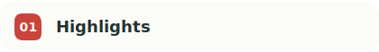
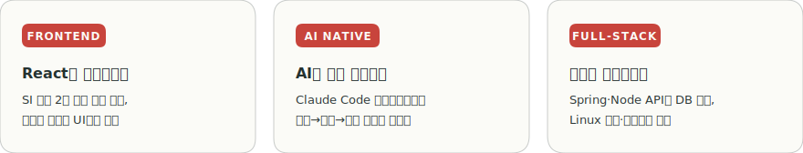
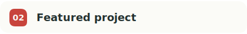
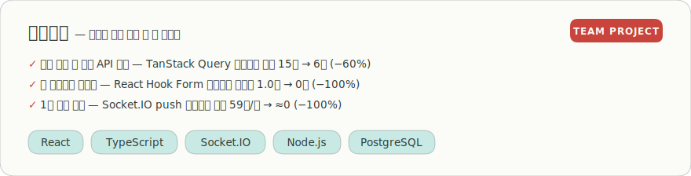
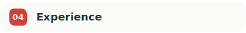

<!-- 히어로: AI Native 풀스택(프론트 중심) 포지셔닝 -->

 

<!-- 01 Highlights -->
<picture>
  <source media="(prefers-color-scheme: dark)" srcset="assets/section-highlights-dark.svg" />
  
</picture>

<picture>
  <source media="(prefers-color-scheme: dark)" srcset="assets/highlights-dark.svg" />
  
</picture>

  

<!-- 02 Featured project -->
<picture>
  <source media="(prefers-color-scheme: dark)" srcset="assets/section-project-dark.svg" />
  
</picture>

<picture>
  <source media="(prefers-color-scheme: dark)" srcset="assets/project-dark.svg" />
  
</picture>

<!-- 03 Experience -->
<picture>
  <source media="(prefers-color-scheme: dark)" srcset="assets/section-career-dark.svg" />
  
</picture>

<table>
  <tr>
    <th width="190">Period</th>
    <th width="220">Organization</th>
    <th>Role</th>
  </tr>
  <tr>
    <td align="center"><b>2022.03 – 2024.03</b></td>
    <td><b>제타럭스시스템</b> SI사업부 / 주임 · 공공·지자체 발주 웹 프로젝트</td>
    <td>
      <b>Front-End (주력)</b> · React 기반 UI/UX 설계 및 화면 기능 구현 
      <b>Back-End</b> · REST API·DB 설계와 쿼리 작성 
      <b>Infra</b> · Linux 환경 WAS 배포·운영
    </td>
  </tr>
</table>

 

<!-- 04 Certifications -->
<picture>
  <source media="(prefers-color-scheme: dark)" srcset="assets/section-cert-dark.svg" />
  
</picture>

| Certification | Issued by |
| :--- | :--- |
| **정보처리기사** | 한국산업인력공단 |
| **삼성 소프트웨어 역량테스트 A 등급** | Samsung Electronics |

 

<!-- 05 Contact -->
<picture>
  <source media="(prefers-color-scheme: dark)" srcset="assets/section-contact-dark.svg" />
  
</picture>

 

